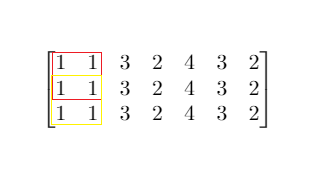

给你一个大小为 m x n 的矩阵 mat 和一个整数阈值 threshold。

请你返回元素总和小于或等于阈值的正方形区域的最大边长；如果没有这样的正方形区域，则返回 0 。

**例1：**

```
输入：mat = [[1,1,3,2,4,3,2],[1,1,3,2,4,3,2],[1,1,3,2,4,3,2]], threshold = 4
输出：2
解释：总和小于或等于 4 的正方形的最大边长为 2，如图所示。
```

**提示:**
```
m == mat.length
n == mat[i].length
1 <= m, n <= 300
0 <= mat[i][j] <= 10^4
0 <= threshold <= 10^5
```

