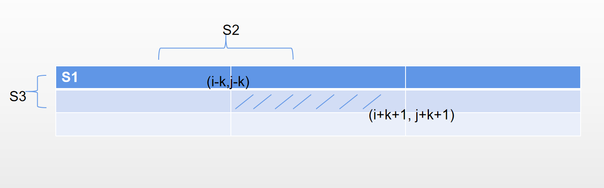

# 模拟/二维前缀和+动态规划
## 思路
### 方法一（模拟）：
1. 题目数据$1 <= m, n, k <= 100$，完全可以直接模拟。注意$r、c$需要$>=0 \&\& <m、n$
### 复杂度
- 时间复杂度:
  > $O(mn*2k)$
- 空间复杂度:
  > $O(mn)$
### Code
```C++[]
class Solution {
public:
    vector<vector<int>> matrixBlockSum(vector<vector<int>>& mat, int k) {
        int m = mat.size(), n = mat[0].size();
        vector<vector<int>> ans(m, vector<int>(n));
        for (int i = 0;i < m;++i) {
            for (int j = 0;j < n;++j) {
                int sum = 0;
                for (int r = i - k;r <= i + k;++r) {
                    if (r < 0 || r >= m) continue;
                    for (int c = j - k;c <= j + k;++c) {
                        if (c < 0 || c >= n) continue;
                        sum += mat[r][c];
                    }
                }
                ans[i][j] = sum;
            }
        }
        return ans;
    }
};
```

### 方法二（二维前缀和+动态规划）：
1. 二维前缀和$pre\_sum[i][j]$表示从$[0,0]$到$[i-1][j-1]$矩阵的和，所以需要$[m+1][n+1]$来维护
2. 那么求$mat[i-k][j-k]$到$mat[i+k][j+k]$转变为$pre\_sum[i-k-1+1][j-k-1+1]$到$pre\_sum[i+k+1][j+k+1]$的区间和

如下图：


- 画线面积为所求面积$S_{ans}=S-S2-S3+S1$
- 即$ans[i][j]=pre\_sum[i+k+1][j+k+1]-pre\_sum[i-k][j+k+1]-pre\_sum[i+k+1][j-k]+pre\_sum[i-k][j-k]$
- 注意边界条件$pre\_sum[x][y]$中$x=max(min(i,m),0)$，$y=max(min(j,n),0)$

### 复杂度
- 时间复杂度:
  > $O(mn)$
- 空间复杂度:
  > $O(mn)$

### Code
```C++[]
class Solution {
public:
    vector<vector<int>> matrixBlockSum(vector<vector<int>>& mat, int k) {
        int m = mat.size(), n = mat[0].size();
        vector<vector<int>> pre_sum(m + 1, vector<int>(n + 1)), ans(m, vector<int>(n));
        for (int i = 1;i <= m;++i) {
            for (int j = 1;j <= n;++j) {
                pre_sum[i][j] = pre_sum[i - 1][j] + pre_sum[i][j - 1] - pre_sum[i - 1][j - 1] + mat[i - 1][j - 1];
            }
        }

        auto get = [&](int x, int y)->int {
            int cx = max(min(x, m), 0);
            int cy = max(min(y, n), 0);
            return pre_sum[cx][cy];
        };

        for (int i = 0;i < m;++i) {
            for (int j = 0;j < n;++j) {
                ans[i][j] = get(i + k + 1, j + k + 1) + get(i - k, j - k) - get(i + k + 1, j - k) - get(i - k, j + k + 1);
            }
        }
        return ans;
    }
};
```